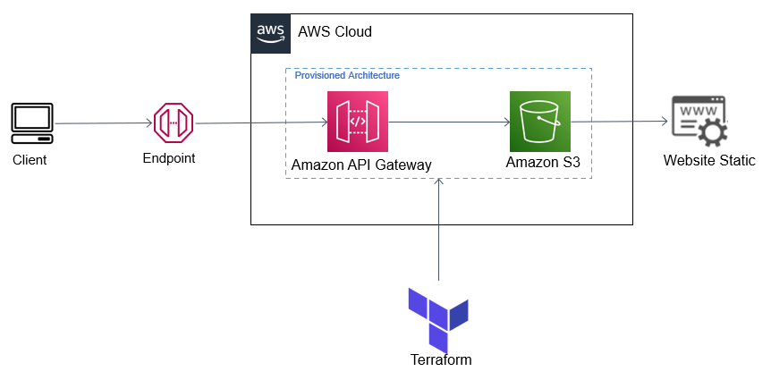

# 
 CloudDefend 

</img>

  
Caso seu objetivo seja boas práticas na hospedagem de um site estático, na qual você quer utilizar o endpoint fornecido da API Gateway (utilizando ela como proxy), esse é o tutorial adequado para você. Vamos utilizar os recursos do terraform para montar nossa infraestrutura.

Observe Abaixo a Arquitetura:

## **Acesse a documentação** 
Nela é possível visualizar como executar toda a infraestrutura do projeto:
<h3>https://ricardomourao-py.github.io/CloudDefend/apiProxy/
