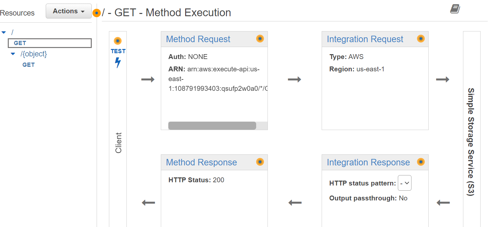

# <b> API Gateway Proxy </b>

## Introdução

Caso seu objetivo seja boas práticas na hospedagem de um site estático, na qual você quer utilizar o endpoint fornecido da API Gateway (utilizando ela como proxy), esse é o tutorial adequado para você. Vamos utilizar os recursos do [terraform](https://developer.hashicorp.com/terraform/tutorials/aws-get-started/infrastructure-as-code) para montar nossa infraestrutura.

Observe Abaixo a Arquitetura:


---------------------------------------------- 
## Metodologia

1. Em primeiro momento, **se ainda não clonou**, no seu diretório clone o repositório e entre na raiz do repositório. Se clonou, siga para a etapa 2:
```
git clone https://github.com/RicardoMourao-py/CloudDefend.git
```
2. Entre na branch `api` com o comando abaixo:
```
git checkout api
```
3. Na pasta raíz, exporte as credenciais da sua conta da AWS no terminal:
```
export AWS_ACCESS_KEY_ID=<ID_CHAVE_DE_ACESSO>
export AWS_SECRET_ACCESS_KEY=<CHAVE_SECRETA_DE_ACESSO>
```
4. Modifique o `index.html` e o `error.html` de acordo com o site estático que deseja gerar para o usuário.
5. Inicie o ambiente Terraform, carregando as dependências necessárias:
```
terraform init
```
6. Aplique e solicite ao terraform que provisione os recursos solicitados na nuvem:
```
terraform apply
```
7. Por fim, visualize se foi criado corretamente a infraestrutura no console da AWS.

---------------------------------------------- 
## Imagens de Verificação


<center>**Tela de Início da API**</center> <br>

</img>


<center>**Tela com o Fluxo do Método na Raiz**</center> <br>

</img>


<center>**Tela com o Fluxo do Método do Recurso**</center> <br>

</img>


<center>**Tela Stage do MyS3 com o seu Endpoint**</center> <br>

</img>


<center>**Tela de Política do Bucket integrada a API**</center> <br>

</img>

!!! warning
    Observe que caso queira acessar o site pelo endpoint fornecido no S3 não é mais possível, e sim apenas pelo endpoint da API.
---------------------------------------------- 
## Código

O código por completo se encontra no arquivo `main.tf`. As etapas abaixo explicam o passo a passo para cada recurso criado pelo terraform. Vale ressaltar, esta etapa segue este [tutorial da aws](https://repost.aws/knowledge-center/api-gateway-s3-website-proxy)

Em primeiro momento, é criado o provider da infraestrutura do nosso projeto, responsável por especificar a região onde vamos trabalhar:

``` tf hl_lines="3" linenums="3" title="main.tf"
# Provide AWS Credentials
provider "aws" {
  region = "us-east-1"
}
```

Logo em seguida, há a configuração das políticas necessárias para execução do projeto. É criado uma função do IAM contendo uma política de confiança para que a API Gateway assuma a função. É criado uma política do AWS Identity and Access Management (IAM) com permissão para a API GetObject para o bucket do Amazon S3. É anexado a política de acesso criada anteriormente na role da API Gateway. É criada uma política do bucket para permitir que o proxy da API acesse apenas o bucket do Amazon S3:

``` tf hl_lines="2 23 48 54" linenums="10" title="main.tf"
# Cria função da integração com a política necessária
resource "aws_iam_role" "s3_api_gateyway_role" {
  name = "s3-api-gateyway-role"

  assume_role_policy = <<EOF
{
  "Version": "2012-10-17",
  "Statement": [
    {
      "Sid": "",
      "Effect": "Allow",
      "Principal": {
        "Service": "apigateway.amazonaws.com"
      },
      "Action": "sts:AssumeRole"
    }
  ]
} 
  EOF
}

# Anexar política de acesso S3 à função de gateway de API
resource "aws_iam_role_policy_attachment" "s3_policy_attach" {
  role       = "${aws_iam_role.s3_api_gateyway_role.name}"
  policy_arn = "${aws_iam_policy.s3_policy.arn}"  
}

# Create S3 Full Access Policy
resource "aws_iam_policy" "s3_policy" {
  name        = "s3-policy"
  description = "Policy for allowing all S3 Actions"

  policy = <<EOF
{
    "Version": "2012-10-17",
    "Statement": [
        {
            "Effect": "Allow",
            "Action": "s3:*",
            "Resource": "*"
        }
    ]
}
EOF
}

# Cria a política do bucket
resource "aws_s3_bucket_policy" "bucket_policy" {
  bucket = aws_s3_bucket.site_bucket.id
  policy = data.aws_iam_policy_document.allow_access_from_another_account.json
}

# cria um IAM para ser referenciado na política do bucket
data "aws_iam_policy_document" "allow_access_from_another_account" {
  version = "2012-10-17"
  
  statement {
    sid     = "APIProxyBucketPolicy"
    actions = ["s3:GetObject"]
    effect  = "Allow"
    principals {
      type        = "Service"
      identifiers = ["apigateway.amazonaws.com"]
    }
    resources = ["arn:aws:s3:::check-request-2/*"]
    condition {
      test     = "ArnLike"
      variable = "aws:SourceArn"
      values   = ["arn:aws:execute-api:us-east-1:108791993403:${aws_api_gateway_rest_api.MyS3.id}/*/GET/"]
    }
  }
}
```

Nesta etapa é criado o bucket S3 com todas as configurações necessárias para a hospedagem do site estático com segurança. É criado um bucket S3, com nome `check-request-2`. Além disso, é habilitado o versionamento o seu versionamento. Por fim, é adicionado e configurado os arquivos `index.html` e `error.html` no bucket. Ademais, nesse trecho de código, é configurado os arquivos de índice e de erro. Em seguida, é configurado o acesso público do bucket:

``` tf hl_lines="2 5 12 19 31 35 39" linenums="85" title="main.tf"
resource "aws_s3_bucket" "site_bucket" {
  bucket = "check-request-2"
}

resource "aws_s3_bucket_versioning" "versioning_S3" {
  bucket = aws_s3_bucket.site_bucket.id
  versioning_configuration {
    status = "Enabled"
  }
}

resource "aws_s3_object" "index" {
  bucket = aws_s3_bucket.site_bucket.id
  key    = "index.html"
  source = "index.html"
  content_type = "text/html"
}

resource "aws_s3_object" "error" {
  bucket = aws_s3_bucket.site_bucket.id
  key    = "error.html"
  source = "error.html"
  content_type = "text/html"
}


resource "aws_s3_bucket_website_configuration" "site_bucket" {
  bucket = aws_s3_bucket.site_bucket.id

  index_document {
    suffix = "index.html"
  }

  error_document {
    key = "error.html"
  }
}

resource "aws_s3_bucket_public_access_block" "meu_bucket" {
  bucket = aws_s3_bucket.site_bucket.id

  block_public_acls       = false
  block_public_policy     = false
  ignore_public_acls      = false
  restrict_public_buckets = false
}
```

Nesta etapa é criada a API Gateway com todas as configurações necessárias para funcionar como proxy. Sendo assim, o client só conseguirá acessar o site com o endpoint da API. Em primeiro momento, é criado a API Gateway com seu respectivo nome. Logo em seguida, é criado um método GET na raiz da API e a sua integração usa como propriedades HTTP_METHOD do tipo GET, tipo AWS Service, conexão com o buclet S3 no arquivo index.html. Além disso, a configuração é finalizada com o arn da role criada na etapa de políticas. É criado o recurso `{object}` e um método GET dentro do recurso. Ademais, a sua integração segue os mesmos princípios que a etapa anterior, com a única exceção que esse método tem no integration request,  a configuração do URL path Parameters. É configurado o Method Response do GET raiz e o GET do object, além de habilitar `method.response.header.Content-Type` para a próxima etapa. Ademais, é configurado o integration response com os parâmetros necessários para adicionar um valor em `Content-Type`, criado na etapa anterior, no integration response. Por fim, é feito deploy da aplicação com o nome do estágio MyS3: 

``` tf hl_lines="2 8 22 24 25 27 32 39 59 64 77 91 102 113 117 127" linenums="134" title="main.tf"
# Cria API REST
resource "aws_api_gateway_rest_api" "MyS3" {
  name        = "MyS3"
  description = "API for S3 Integration"
}

# Cria o método na raiz
resource "aws_api_gateway_method" "GetBuckets1" {
  rest_api_id   = "${aws_api_gateway_rest_api.MyS3.id}"
  resource_id   = "${aws_api_gateway_rest_api.MyS3.root_resource_id}"
  http_method   = "GET"
  authorization = "NONE"
}

# Etapa para a integração do S3 no GET raiz
resource "aws_api_gateway_integration" "S3Integration1" {
  depends_on = [aws_api_gateway_method.GetBuckets1]
  rest_api_id = "${aws_api_gateway_rest_api.MyS3.id}"
  resource_id = "${aws_api_gateway_rest_api.MyS3.root_resource_id}"
  http_method = "${aws_api_gateway_method.GetBuckets1.http_method}"

  integration_http_method = "GET"

  type = "AWS"
  uri         = "arn:aws:apigateway:us-east-1:s3:path/check-request-2/index.html"
  
  credentials = "${aws_iam_role.s3_api_gateyway_role.arn}"

}

# Criando recurso
resource "aws_api_gateway_resource" "Object" {
  rest_api_id = "${aws_api_gateway_rest_api.MyS3.id}"
  parent_id   = "${aws_api_gateway_rest_api.MyS3.root_resource_id}"
  path_part   = "{object}"
}

# Cria o método no recurso
resource "aws_api_gateway_method" "GetBuckets2" {
  rest_api_id   = "${aws_api_gateway_rest_api.MyS3.id}"
  resource_id   = "${aws_api_gateway_resource.Object.id}"
  http_method   = "GET"
  authorization = "NONE"

  request_parameters = {
    "method.request.path.object" = true
  }
}

# Etapa para a integração do S3 no GET do object
resource "aws_api_gateway_integration" "S3Integration2" {
  rest_api_id = "${aws_api_gateway_rest_api.MyS3.id}"
  resource_id = "${aws_api_gateway_resource.Object.id}"
  http_method = "${aws_api_gateway_method.GetBuckets2.http_method}"

  integration_http_method = "GET"

  type = "AWS"
  uri         = "arn:aws:apigateway:us-east-1:s3:path/check-request-2/{object}"
  
  credentials = "${aws_iam_role.s3_api_gateyway_role.arn}"

  request_parameters = {
      "integration.request.path.object" = "method.request.path.object"
    }
}

resource "aws_api_gateway_integration_response" "MyS3IntegrationResponse" {
  depends_on = [aws_api_gateway_integration.S3Integration1]

  rest_api_id = "${aws_api_gateway_rest_api.MyS3.id}"
  resource_id = "${aws_api_gateway_rest_api.MyS3.root_resource_id}"
  http_method = "${aws_api_gateway_method.GetBuckets1.http_method}"
  status_code       = "200"  

  response_parameters = {
    "method.response.header.Content-Type"   = "integration.response.header.Content-Type"
  }

}

resource "aws_api_gateway_integration_response" "MyS3IntegrationResponse_object" {
  depends_on = [aws_api_gateway_integration.S3Integration2]

  rest_api_id = "${aws_api_gateway_rest_api.MyS3.id}"
  resource_id = "${aws_api_gateway_resource.Object.id}"
  http_method = "${aws_api_gateway_method.GetBuckets2.http_method}"
  status_code       = "200"  

  response_parameters = {
    "method.response.header.Content-Type"   = "integration.response.header.Content-Type"
  }
}

resource "aws_api_gateway_method_response" "response_200" {
  rest_api_id = aws_api_gateway_rest_api.MyS3.id
  resource_id = aws_api_gateway_rest_api.MyS3.root_resource_id
  http_method = aws_api_gateway_method.GetBuckets1.http_method
  status_code = "200"

  response_parameters = {
    "method.response.header.Content-Type" = true
  }
}
 
resource "aws_api_gateway_method_response" "response_200_object" {
  rest_api_id = aws_api_gateway_rest_api.MyS3.id
  resource_id = aws_api_gateway_resource.Object.id
  http_method = aws_api_gateway_method.GetBuckets2.http_method
  status_code = "200"

  response_parameters = {
    "method.response.header.Content-Type" = true
  }
}

resource "aws_api_gateway_deployment" "S3APIDeployment" {
  depends_on  = [aws_api_gateway_method.GetBuckets1,
                 aws_api_gateway_method.GetBuckets2, aws_api_gateway_method_response.response_200_object,
                 aws_api_gateway_method_response.response_200, aws_api_gateway_integration_response.MyS3IntegrationResponse_object,
                 aws_api_gateway_integration_response.MyS3IntegrationResponse, aws_api_gateway_integration.S3Integration1,
                 aws_api_gateway_integration.S3Integration2, aws_api_gateway_resource.Object
                ]
  rest_api_id = "${aws_api_gateway_rest_api.MyS3.id}"
}

resource "aws_api_gateway_stage" "MyS3stage" {
  depends_on  = [aws_api_gateway_method.GetBuckets1, aws_api_gateway_deployment.S3APIDeployment,
                 aws_api_gateway_method.GetBuckets2, aws_api_gateway_method_response.response_200_object,
                 aws_api_gateway_method_response.response_200, aws_api_gateway_integration_response.MyS3IntegrationResponse_object,
                 aws_api_gateway_integration_response.MyS3IntegrationResponse, aws_api_gateway_integration.S3Integration1,
                 aws_api_gateway_integration.S3Integration2, aws_api_gateway_resource.Object
                ]
  stage_name      = "MyS3"
  rest_api_id     = aws_api_gateway_rest_api.MyS3.id
  deployment_id   = aws_api_gateway_deployment.S3APIDeployment.id
}
```