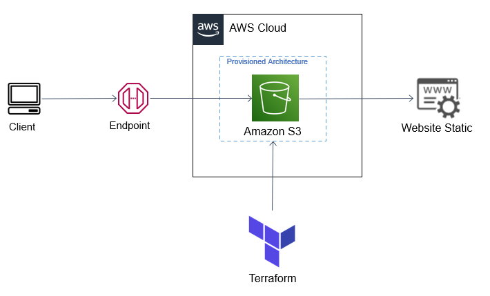
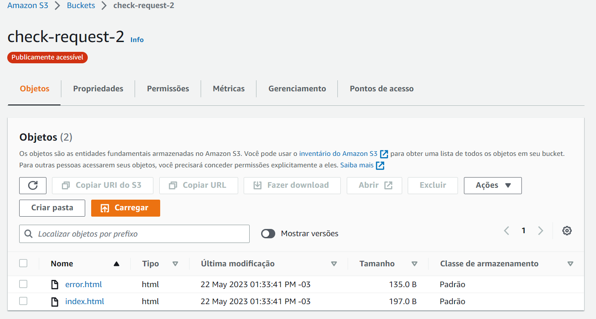
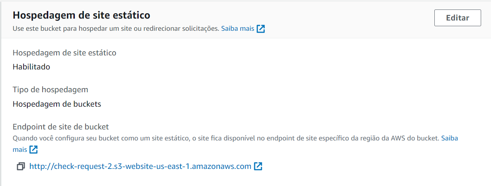
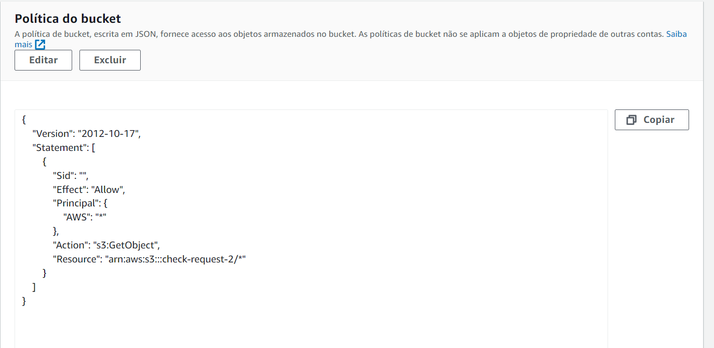
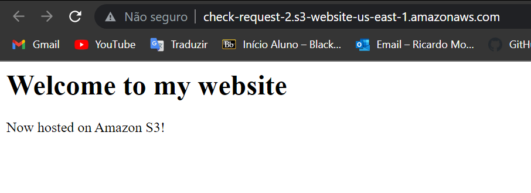

# <b> Hospeda Site no S3 </b>

## Introdução

Caso seu objetivo seja apenas apenas a hospedagem de um site estático e nada mais, esse é o tutorial adequado para você. Vamos utilizar os recursos do [terraform](https://developer.hashicorp.com/terraform/tutorials/aws-get-started/infrastructure-as-code) para montar nossa infraestrutura.

Observe Abaixo a Arquitetura:


---------------------------------------------- 
## Metodologia

1. Em primeiro momento, **se ainda não clonou**, no seu diretório clone o repositório e entre na raiz do repositório. Se clonou, siga para a etapa 2:
```
git clone https://github.com/RicardoMourao-py/CloudDefend.git
```
2. Entre na branch `s3` com o comando abaixo:
```
git checkout s3
```
3. Na pasta raíz, exporte as credenciais da sua conta da AWS no terminal:
```
export AWS_ACCESS_KEY_ID=<ID_CHAVE_DE_ACESSO>
export AWS_SECRET_ACCESS_KEY=<CHAVE_SECRETA_DE_ACESSO>
```
4. Modifique o `index.html` e o `error.html` de acordo com o site estático que deseja gerar para o usuário.
5. Inicie o ambiente Terraform, carregando as dependências necessárias:
```
terraform init
```
6. Aplique e solicite ao terraform que provisione os recursos solicitados na nuvem:
```
terraform apply
```
7. Por fim, visualize se foi criado corretamente a infraestrutura no console da AWS.

---------------------------------------------- 
## Imagens de Verificação
 

<center>**Tela de Início do Bucket**</center> <br>

</img>


<center>**Aba de propriedades do Bucket**</center> <br>

</img>


<center>**Aba de políticas do Bucket**</center> <br>

</img>


<center>**Visualize se WebSite com seu Endpoint Público**</center> <br>

</img>

----------------------------------------------
## Código 

O código por completo se encontra no arquivo `main.tf`. As etapas abaixo explicam o passo a passo para cada recurso criado pelo terraform. Vale ressaltar, esta etapa segue este [tutorial da aws](https://docs.aws.amazon.com/AmazonS3/latest/userguide/HostingWebsiteOnS3Setup.html)

Primeiramente, é definido no provider a região na qual iremos trabalhar, em que no nosso caso é Norte da Virgínia:

``` tf hl_lines="2" linenums="1" title="main.tf"
provider "aws" {
  region = "us-east-1"
}
```

Nesta etapa, é definido sua acl, seu nome e seu versionamento.

``` tf hl_lines="2 3 5" linenums="5" title="main.tf"
resource "aws_s3_bucket" "site_bucket" {
  bucket = "check-request-2"
  acl    = "private"
  versioning {
    enabled = true
  }
}
```

É definido principlamente os arquivos do bucket, como também as suas chaves.

``` tf linenums="13" title="main.tf"
resource "aws_s3_bucket_object" "index" {
  bucket = aws_s3_bucket.site_bucket.id
  key    = "index.html"
  source = "index.html"
  content_type = "text/html"
}

resource "aws_s3_bucket_object" "error" {
  bucket = aws_s3_bucket.site_bucket.id
  key    = "error.html"
  source = "error.html"
  content_type = "text/html"
}
```

Nesta etapa, é configurado os arquivos de índice e de error do seu site. Observe abaixo que possuímos `depends_on`, logo, esse recurso só é criado depois dos dois primeiros acima.

``` tf hl_lines="13 14" linenums="27" title="main.tf"
resource "aws_s3_bucket_website_configuration" "site_bucket" {
  bucket = aws_s3_bucket.site_bucket.id

  index_document {
    suffix = "index.html"
  }

  error_document {
    key = "error.html"
  }

  depends_on = [
    aws_s3_bucket_object.index,
    aws_s3_bucket_object.error,
  ]
}
```

Além disso, é configurado a etapa de acesso público da seguinte maneira:

``` tf linenums="44" title="main.tf"
resource "aws_s3_bucket_public_access_block" "meu_bucket" {
  bucket = aws_s3_bucket.site_bucket.id

  block_public_acls       = false
  block_public_policy     = false
  ignore_public_acls      = false
  restrict_public_buckets = false
}
```

Finalmente, a política é criada logo após o bucket ser configurado:

``` tf hl_lines="6 10" linenums="53" title="main.tf"
resource "aws_s3_bucket_policy" "bucket_policy" {
  bucket = aws_s3_bucket.site_bucket.id
  policy = data.aws_iam_policy_document.allow_access_from_another_account.json

  depends_on = [
    aws_s3_bucket_website_configuration.site_bucket,
  ]
}

data "aws_iam_policy_document" "allow_access_from_another_account" {
  version = "2012-10-17"
  
  statement {
    actions = ["s3:GetObject"]
    effect  = "Allow"
    principals {
      type        = "AWS"
      identifiers = ["*"]
    }
    resources = ["arn:aws:s3:::check-request-2/*"]
  }
}
```