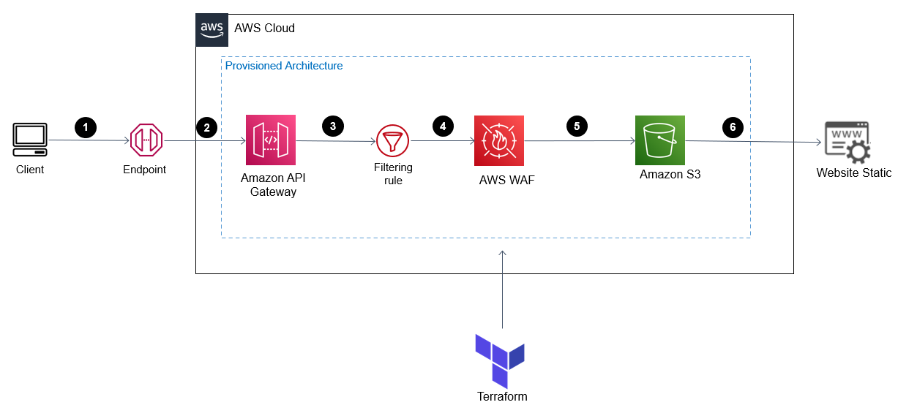
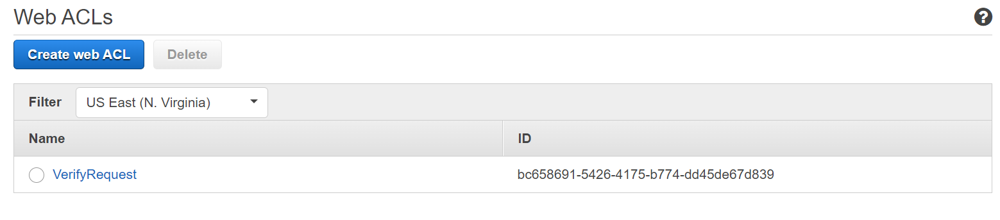
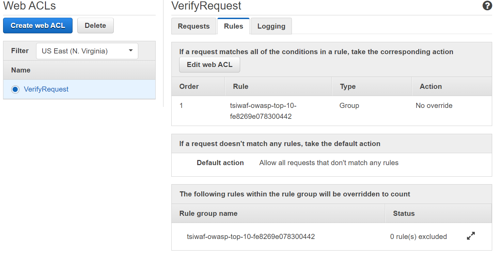
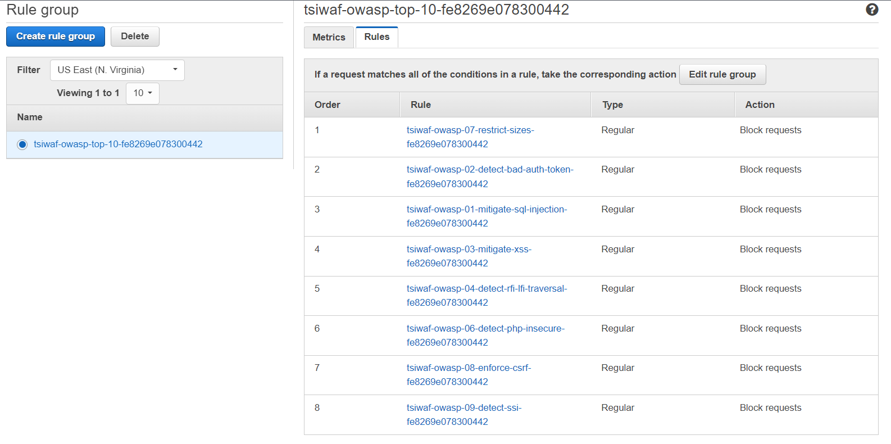
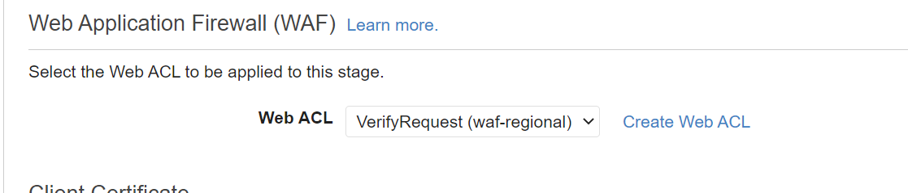

# <b> Proteção WAF </b>

## Introdução

Caso seu objetivo seja boas práticas na hospedagem de um site estático, na qual você quer utilizar o endpoint fornecido da API Gateway (utilizando ela como proxy), mas além disso quer proteger seu WebSite de requisições maliciosas, esse é o tutorial adequado para você. Vamos utilizar os recursos do [terraform](https://developer.hashicorp.com/terraform/tutorials/aws-get-started/infrastructure-as-code) para montar nossa infraestrutura.

Observe abaixo a arquitetura:


---------------------------------------------- 
## Metodologia
Caso prefira, no vídeo abaixo é possível ver a implementação do projeto completo.

<iframe width="630" height="450" src="https://www.youtube.com/embed/z0gkqTylu5k" title="Hospede seu Site com Segurança na AWS" frameborder="0" allow="accelerometer; autoplay; clipboard-write; encrypted-media; gyroscope; picture-in-picture; web-share" allowfullscreen></iframe>

1. Em primeiro momento, **se ainda não clonou**, no seu diretório clone o repositório e entre na raiz do repositório. Se clonou, siga para a etapa 2:
```
git clone https://github.com/RicardoMourao-py/CloudDefend.git
```
2. Entre na branch `main` com o comando abaixo:
```
git checkout main
```
3. Na pasta raíz, exporte as credenciais da sua conta da AWS no terminal:
```
export AWS_ACCESS_KEY_ID=<ID_CHAVE_DE_ACESSO>
export AWS_SECRET_ACCESS_KEY=<CHAVE_SECRETA_DE_ACESSO>
```
4. Modifique o `index.html` e o `error.html` de acordo com o site estático que deseja gerar para o usuário.
5. Inicie o ambiente Terraform, carregando as dependências necessárias:
```
terraform init
```
6. Aplique e solicite ao terraform que provisione os recursos solicitados na nuvem:
```
terraform apply
```
7. Por fim, visualize se foi criado corretamente a infraestrutura no console da AWS.

!!! warning 
    Caso obtenha um erro WAFUnavailableEntityException depois da etapa 6, de acordo com um [fórum da AWS](https://repost.aws/questions/QUQeWJBFD-QzeD17h5BJwZYg/error-wafunavailableentityexception) pode ser necessário aguardar alguns minutos para criar alguns recursos que estão associados, sendo assim, basta executar o comando novamente.
---------------------------------------------- 
## Imagens de Verificação


<center>**Tela de Início do WAF**</center> <br>

</img>


<center>**Tela da WebACL com o grupo de regras OWASP**</center> <br>

</img>


<center>**Tela do grupo com as regras do OWASP Top Ten**</center> <br>

</img>


<center>**Tela do Estágio da API associado a WebACL Criada**</center> <br>

</img>

---------------------------------------------- 
## Código

O código por completo se encontra no arquivo `main.tf`. As etapas abaixo explicam o passo a passo para cada recurso criado pelo terraform. Entretanto, vale ressaltar que só vamos explicar nessa aba, os recursos criados para o WAF, pois nesta [aba](../apiProxy/#codigo) da API Gateway como Proxy já explicamos as finalidades dos recursos criados.

!!! warning 
    Este código foi baseado na [documentação do terraform](https://registry.terraform.io/modules/traveloka/waf-owasp-top-10-rules/aws/latest/examples/owasp-top-10), entretanto, o repositório foi arquivado, dificultando as boas práticas. Como solução, foi adicionada a pasta `waf/` com todos os requisitos do owasp top ten de acordo com a referência.

Para garantir total segurança para o site, foi implementado o WAF com todas as 10 principais regras do OWASP. Sendo assim, foi criado uma WebACL para um WafRegional com o nome de `VerifyRequest`. Além disso, foi settado um grupo de regras que vem do módulo criado de acordo com a documentação do terraform. Por fim, é associado a WebACL criada com o estágio criado pela API Gateway.

``` tf hl_lines="1 21 32 43" linenums="273" title="main.tf"
module "owasp_top_10" {
  # This module is published on the registry: https://registry.terraform.io/modules/traveloka/waf-owasp-top-10-rules    

  # Open the link above to see what the latest version is. Highly encouraged to use the latest version if possible.

  source = "./waf"

  # For a better understanding of what are those parameters mean,
  # please read the description of each variable in the variables.tf file:
  # https://github.com/traveloka/terraform-aws-waf-owasp-top-10-rules/blob/master/variables.tf 

  product_domain                 = "tsi"
  service_name                   = "tsiwaf"
  environment                    = "staging"
  description                    = "OWASP Top 10 rules for tsiwaf"
  target_scope                   = "regional"
}


resource "aws_wafregional_web_acl" "WafDefend" {
  name        = "VerifyRequest"
  metric_name = "VerifyRequest"

  default_action {
    type = "ALLOW"
  }

  rule {
    priority = "0"

    # ID of the associated WAF rule
    rule_id = module.owasp_top_10.rule_group_id

    type = "GROUP"

    override_action {
      # Valid values are `NONE` and `COUNT`
      type = "NONE"
    }
  }
}

resource "aws_wafregional_web_acl_association" "AssociaWAF" {
  depends_on = [aws_api_gateway_stage.MyS3stage]
  resource_arn = aws_api_gateway_stage.MyS3stage.arn
  web_acl_id   = aws_wafregional_web_acl.WafDefend.id
}
```